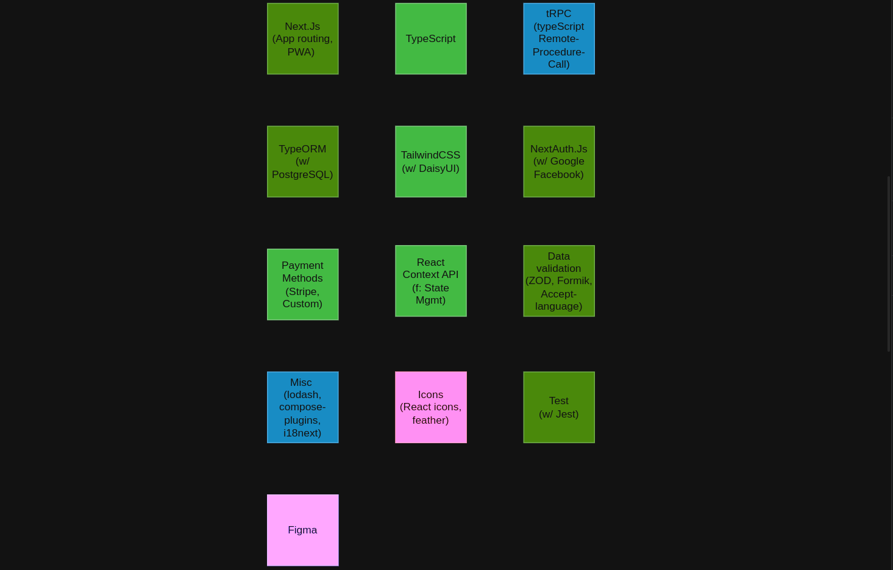
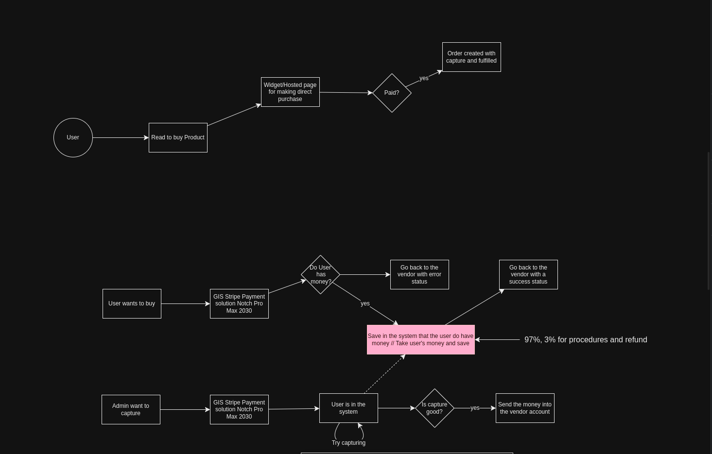
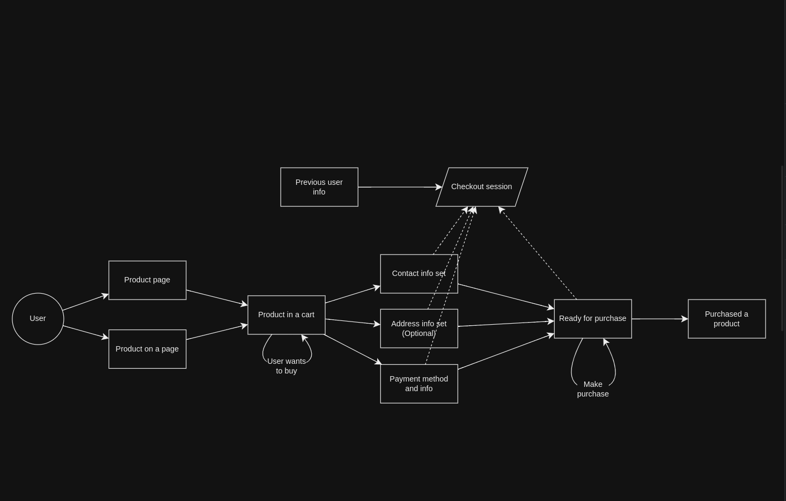
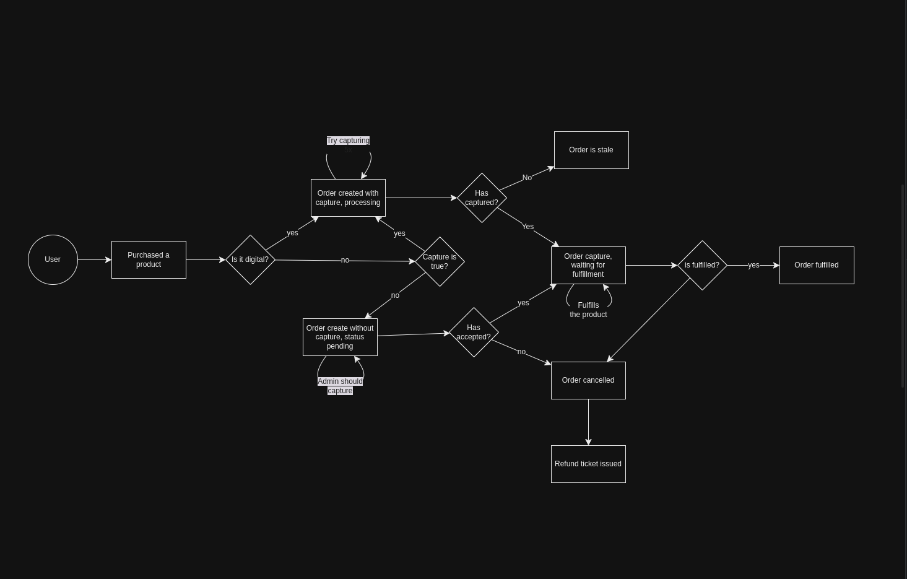
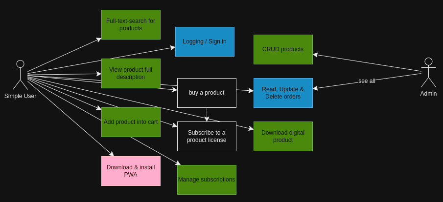
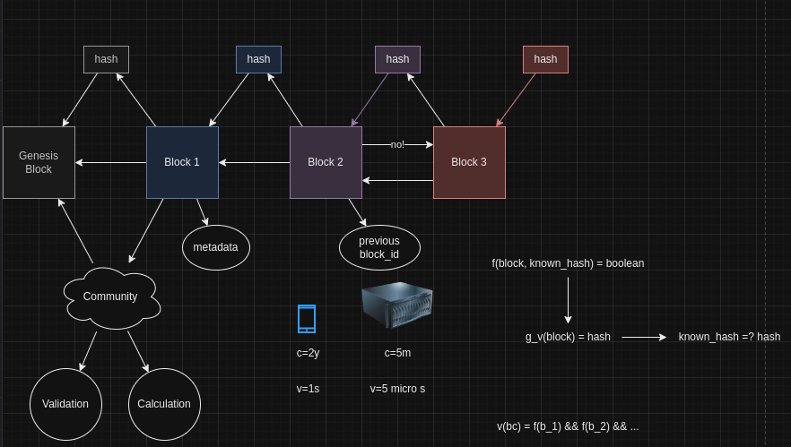

# Stripe Integration Demo Project

### Project Overview
The Stripe Integration Demo Project is a hands-on initiative designed to enhance the team’s expertise in Stripe's API and infrastructure. By building a full-stack application from scratch, the team aims to deepen their understanding of both the front-end and back-end components of Stripe-based systems. This project will also act as a foundational platform for the upcoming Payment Processor Project, which will be developed for commercial use.

### Key Objectives:

Build a full-stack demo application with Stripe integration using Next.js.
Develop a comprehensive understanding of the technologies involved in Stripe projects, such as payment processing, subscriptions, and invoice management.
Prepare for future Stripe projects by mastering relevant concepts and components.

### Project Goals 
Technical Proficiency: At the end of the project, each team member should be able to explain the technologies implemented, including the following components:

Front-end and back-end integration using Next.js.
Database management and TypeORM.
Stripe's payment processing and subscription management functionalities.
End-to-End Functionality: Implement a working end-to-end (E2E) application that demonstrates a complete Stripe workflow, including:

A Store with payment options.
One-time and subscription-based payments.
Invoice and subscription management.
Deployment and Maintenance: Develop strategies for deployment and ongoing maintenance of the application.

### Tech Stack
The project will leverage the following technologies:

Next.js: Chosen for both front-end and back-end development due to its popularity and recent adoption in Stripe projects.
React: For building responsive and interactive user interfaces.
Express: For handling server-side logic.
TypeORM: For database management and modeling.
NextAuth.js: To manage authentication, with custom configuration for compatibility with our backend.
Other Libraries: Abstract classes, plugins, and third-party resources as needed.
Timeline and Milestones
The estimated project duration is 8 to 10 weeks. Key milestones include:

Project Setup & Initial Development (Weeks 1-2): Establish the tech stack and create the initial project framework.
Store & Payment Features (Weeks 3-6): Develop the store functionality, including one-time and subscription payments.
Invoice & Subscription Management (Weeks 6-8): Implement invoice management and subscription handling.
Testing & Review (Week 9): Conduct extensive testing, review sequence diagrams, and make necessary adjustments.
Deployment & Maintenance Strategy (Week 10): Prepare for deployment and finalize the project documentation.
Features and Requirements
The application will include the following key features:

### Store:

Product listings, order management, and checkout functionality.
Payments:

Support for one-time and subscription payments through Stripe.
Invoice Management:

Integration with Stripe for managing invoices and billing.
Authentication:

User login and authentication using NextAuth.js.
Session management to identify logged-in users using the useSession hook.

### Admin Panel:

Using React Admin (RA) to handle CRUD operations for products and orders.
Custom pages for product and order management.
Configurations to ensure backend connectivity and secure authentication.
Technical Considerations
Abstract Classes and Plugins: We will utilize abstract classes and plugins for code reusability and modularity.
Progressive Web App (PWA): Research has been conducted on how to implement PWA features, including triggering installations.

### Development Methodology
For this demo project, we are following a collaborative workflow to ensure consistent progress. Additionally:

Scrum Framework: We will implement Scrum practices, including a monthly Spring Demo to present progress and gather feedback.
Kanban Board: To track tasks and maintain progress transparency. Managed by @Stephane Segning Lambou and @Armand Meppa.

### Diagrams and Visual Documentation
To aid in understanding and clarity, we will be creating and reviewing the following diagrams:

Project Overview Diagram: Visual representation of the overall project structure and workflows.

UML Sequence Diagrams: Detailed sequence diagrams for critical components, such as "Subscribe to Product License" and "Manage Subscriptions."
```mermaid
sequenceDiagram
    title Full test search
    actor User
    User->>Frontend: SearchProduct(text)
    Frontend->>Backend: searchProduct(text)
    Backend->>DB: Search full text
    DB-->>Backend: hits
    Backend-->>Frontend: Hits
```
```mermaid
sequenceDiagram
    title See product discription
    actor User
    User->>Frontend: See a product description
    Frontend->>Backend: getProduct(id)
    Backend->>DB: findById(id)
    DB-->>Backend: product
    Backend-->>Frontend: product
    Frontend->>Frontend: Display the product
```
```mermaid
sequenceDiagram
    title Add to cart
    actor User
    User->>Frontend: Add product to cart
    Frontend->>Backend: addProductToCart(productId)
    Backend->>Backend: getAssociatedCart() # Get cart associated with user
    Backend->>Backend: addProductToCart(cartId, productId)
    Backend-->>Frontend: card
```
```mermaid
sequenceDiagram
    title Download digital product
    actor User
    User->>Frontend: Download a product with id
    Frontend->>Backend: getDownloadProductLink(productId) # Secure this link
    Backend->>Backend: Logic to get the download link of a product for user
    alt External object for links
        Backend->>DB: Read product and get product-download link
        DB-->>Backend: link
    else
        Backend->>DB: Read product and get link from product attribute
        BD-->>Backend: product
        Backend-->>Backend: extract link
    end
    Backend-->>Frontend: link # https://cdn.gis-stripe.cm/download/products/678-23-24324-2343.png
    Frontend->>Web: open link
```
```mermaid
sequenceDiagram
    title Buy a product
    actor User
    User->>Frontend: Buy a cart
    Frontend->>Backend: createOrGetCheckoutSession(cartId)
    Backend-->>Frontend: checkoutSession

    opt Update user contact info
        Frontend->>Frontend: info input
        Frontend->>Backend: updateContactInfo
        Backend->>DB: persist checkoutSession
        DB-->>Backend: ok
        Backend-->>Frontend: checkoutSession
    end

    opt Update user address info
        Frontend->>Frontend: info input
        Frontend->>Backend: updateAddressInfo
        Backend->>Backend: Validate address data
        Backend->>DB: persist checkoutSession
        DB-->>Backend: ok
        Backend-->>Frontend: checkoutSession
    end

    opt Update user payment info
        Frontend->>Frontend: info input
        Frontend->>Backend: updatePaymentInfo
        Backend->>Backend: Validate payment info
        Backend->>PaymentProcessor: Create payment intent
        PaymentProcessor-->>Backend: intent
        Backend->>Backend: Create price estimate
        Backend->>DB: persist checkoutSession
        DB-->>Backend: ok
        Backend-->>Frontend: checkoutSession
    end

    Frontend->>Frontend: use checkoutSession to proceed to payment

    opt Confirm on the backend side
        Frontend->>Backend: Confirm checkout
    end

    Frontend->>Frontend: Show ok page
```
```mermaid
sequenceDiagram
title Subscribe to a product license
actor User
User ->> Client: Selects Product License
Client ->> Server: Send Subscription Request
Server ->> Server: Validate Subscription Request
Server ->> Payment : Initiate Payment
Payment -->> Server: Payment Confirmation
Server ->> DB: Save Subscription and Payment Details
Server -->> Client: Subscription Success with License
Client -->> User: Display Subscription Confirmation
```
```mermaid
sequenceDiagram
title Manage subscription
Customer ->> WebApp: Request to change plan or update payment method
WebApp ->> Payment Processor: Update subscription or payment method
Payment Processor ->> Backend: customer.subscription.updated OR invoice.payment_succeeded
Backend ->> Database: Save updated plan details (e.g., new plan ID, billing cycle)
Backend -->> WebApp: Notify about subscription update status
WebApp -->> Customer: Confirmation of subscription update
Customer ->> WebApp: Request to cancel subscription
WebApp ->> Payment Processor: Cancel subscription (immediate or end of billing period)
Payment Processor ->> Backend: customer.subscription.deleted
Backend ->> Database: Update subscription status to "canceled"
Backend -->> WebApp: Notify about subscription cancellation
WebApp -->> Customer: Confirmation of subscription cancellation
```
 
### Research & Additional Tools
React Admin (RA):

Setup: Establish connection with the backend and authentication using NextAuth.js.
Configuration: Simple, with pages for orders and products.
Customization: Advanced, focusing on theme customization and additional features.
NextAuth.js: Custom configuration for authentication, including handling sessions to retrieve logged-in clients.

No-Code Technologies: @Stephane Segning Lambou presented on no-code technologies, exploring their potential for future projects.

Design Tools: We had an introductory session on Figma for UI design exploration and basic prototype handling.

## Deep dive

- [Tailwindcss](https://v2.tailwindcss.com/docs/functions-and-directives)
- [Lodash](https://lodash.com/docs)
- [Nextjs](https://nextjs.org/docs)
- [Jestjs](https://archive.jestjs.io/docs/en/22.x/jest-platform)
- [i18next](https://www.i18next.com/)
- [Zod](https://zod.dev/)
- [Formik](https://formik.org/docs/overview)
- [Typeorm](https://typeorm.io/)
- [tRPC](https://trpc.io/)
- [creatContext](https://react.dev/reference/react/createContext)
### Pending Topics
Project Name: The name for this project is still to be decided.
Deployment Models and Maintenance: Final decisions on deployment and long-term maintenance are yet to be made.